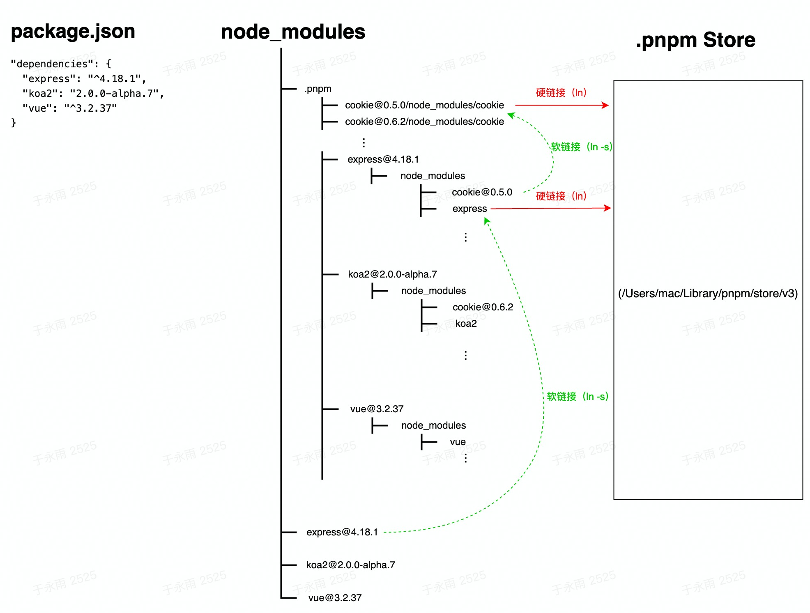
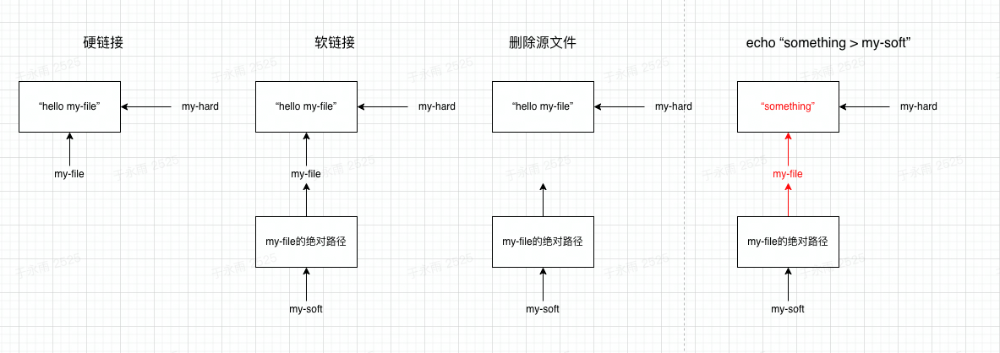

# pnpm

## **一、npm2时代**

### 1、原理图

.jpg>)

### 2、特点：

* 嵌套安装：每个依赖项都有自己的node\_modules文件夹

### 3、问题：

* 依赖树太深，超出windows上目录路径访问长度限制
* 浪费磁盘空间，同一个依赖在不同包下被多次下载


## **二、npm3、yarn时代**

### 1、原理图

.jpg>)

### 2、特点：

* 扁平安装：将依赖提升到平级，对于版本冲突的依赖项继续保留在包的node\_modules中

### 3、问题：

* 被提升的依赖不确定，取决于安装顺序（比如，先安装B，则被提升的则是C V2.0 ）
* 幽灵依赖，没有显式安装依赖却能在项目中直接引用，后续一旦依赖在某个版本被移除则会出问题
* 重复安装（npm2时代的问题没有彻底解决）

npm2

```
- package A
    - packageX 1.0
    - packageY 1.0
- package B
    - packageX 2.0
    - packageY 2.0
- package C
    - packageX 1.0
    - packageY 2.0
- package D
    - packageX 2.0
    - packageY 1.0
```

npm3/yarn

```
- package X => 1.0版本
- package Y => 1.0版本

- package A
- package B
    - packageX 2.0
    - packageY 2.0
- package C
    - packageY 2.0
- package D
    - packageX 2.0
```

如上所示的packageX 2.0和packageY 2.0被重复安装多次

## **三、pnpm时代**

pnpm（persistent npm），主要特点：依赖包的持久化

### 1、原理图：&#x20;

<figure><figcaption><p>pnpm 原理图</p></figcaption></figure>

### 2、原理解释：

* node\_modules下除了package.json中的依赖，还有一个.pnpm，所有的依赖包在.pnpm是平级结构，命名形式：包名@版本号
* .pnpm是个一个虚拟store（Virtual store），里面的依赖包`硬链接`到真实Store（Content-addressable store）中，真实Store才是依赖包文件真正的存储位置
* package.json中的依赖（比如express）通过`软链接`，指向.pnpm下对应的依赖包
* 每次pnpm安装先检查Store，如果已经存在，直接通过硬链接的形式连接到.pnpm；如果不存在，则先下载，然后再硬链接过来

概括：**依赖包** ---(<mark style="color:green;">软</mark>链接)--- > **.pnpm** ----(<mark style="color:red;">硬</mark>链接) ---> **Store**

### 3、问题

* 硬链接在 window 系统有兼容性的问题
* CI/CD 中因为依赖包是全局存储，可能会命中不同的机器，也有可能存在权限的问题


### 4、扩展：软链接 vs 硬链接

<figure><figcaption><p>软链接 vs 硬链接</p></figcaption></figure>

* 硬链接：（**指向目标文件的存储地址**）
  * 与普通文件没什么不同，inode 都指向同一个文件在硬盘中的区块
  * 硬链接不管有多少个，都指向的是同一个 inode 节点，这意味着当你修改源文件或者链接文件的时候，都会做同步的修改
  * 每新建一个 hardlink 会把节点连接数增加，只要节点的链接数非零，文件就一直存在，不管你删除的是源文件还是 hradlink。
  * 只要有一个链接存在，文件就存在。
* 软链接：（**指向目标文件的引用**）
  * 保存了其代表的文件的绝对路径，是另外一种文件，在硬盘上有独立的区块，访问时替换自身路径

参考：

* [https://mp.weixin.qq.com/s/4pXTxgqpIzanfcm75\_vNJQ](https://mp.weixin.qq.com/s/4pXTxgqpIzanfcm75\_vNJQ)
* [https://mp.weixin.qq.com/s/ABnLJlDpxRQSbiHaA-yTDg](https://mp.weixin.qq.com/s/ABnLJlDpxRQSbiHaA-yTDg)
