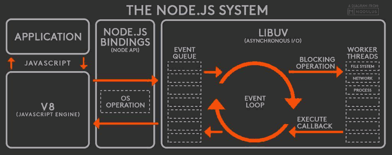

# flex

## &#x20;一、概述

<figure><figcaption></figcaption></figure>

要点：

* flex布局通过将一个元素设置display:flex，使它成为一个flex容器，它的所有子元素都会成为它的项目。
* 一个容器有两条轴：水平的主轴+垂直主轴的交叉轴。
* `flex-direction`用来指定主轴的方向。
* `justify-content`用来指定项目在主轴上的排列方式；`align-items`用来指定项目在交叉轴上的排列方式。
* `flex-wrap`用来规定一行排列不下时的换行方式。
* 对于容器中的项目：
  * `order`属性用来指定项目的排列顺序，
  * `flex-grow`用来指定当排列空间有剩余的时候，项目的放大比例
  * `flex-shrink`用来指定当排列空间不足时，项目的缩小比例

## 二、容器的属性

### 1.flex-direction

主轴方向，即项目排列方向

* row（默认）：水平，从左到右
* row-reverse：水平，从右到左
* column：垂直，从上到下
* column-reverse：垂直，从下到上

### &#x20;2.flex-wrap

轴线如果排列不下，如何换行

* nowrap（默认）：不换行
* wrap：换行，第一行在上方
* wrap-reverse：换行，第一行在下方

### &#x20;3.flex-flow：

flex-direction和flex-wrap的简写

flex-flow: \<flex-direction> || \<flex-wrap>\

### 4.justify-content

项目在**主轴上**的对齐方式

* flex-start（默认）：左对齐
* flex-end：右对齐
* center：居中
* space-between：两端对齐，项目间间隔相等
* space-around：项目两侧间隔相等

### .png>)  5.align-items：

项目在**交叉轴上**的对齐方式

* flex-start：顶部对齐
* flex-end：底部对齐
* center：居中对齐
* baseline：第一行文字的基线对齐
* stretch（默认）：如果项目没有设置定高，或者设置为auto，将占满整个容器高度

### .png>)  6.align-content

多根轴线的对齐方式。如果项目只有一根轴线，此属性不起作用。

* flex-start：自上而下
* flex-end：自下而上
* center：垂直居中
* space-between：自上而下平均排列
* space-around：自上而下间隔相等排列
* strecth（默认值）：占满交叉轴排列

.png>)\

## 三、项目的属性

### 1.order

定义项目的排列顺序。数值越小，排列越靠前，默认为0。

.png>)

### 2.flex-grow

定义项目的**放大**比例，默认为`0`，即如果存在剩余空间，也不放大

.png>)

### 3.flex-shrink

定义项目的**缩小**比例，默认为1，即如果空间不足，该项目将缩小。

.png>)

### 4.align-self

允许单个项目有与其他项目不一样的对齐方式，可覆盖容器的`align-items`属性。

参见：

* [http://www.ruanyifeng.com/blog/2015/07/flex-grammar.html](http://www.ruanyifeng.com/blog/2015/07/flex-grammar.html)
* [https://www.cnblogs.com/qcloud1001/p/9848619.html](https://www.cnblogs.com/qcloud1001/p/9848619.html)

