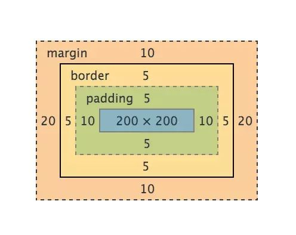
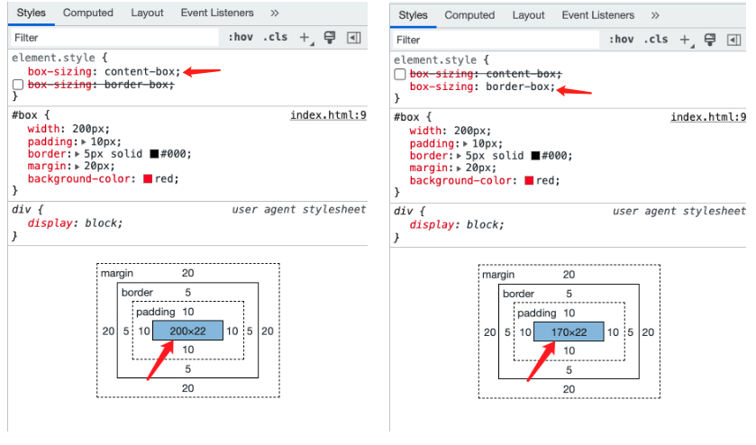

# 盒模型和box-sizing

盒模型：将页面上的元素看作一个盒子，盒子有外到里包含4部分：margin -> border -> padding -> content


```css
.box{
  width: 200px;
  padding: 10px;
  border: 5px solid #000;
  margin: 20px;
}
```

<figure><figcaption><p>盒模型</p></figcaption></figure>

不同浏览器对宽度（高度同样）计算的实现不同，核心差异：<mark style="color:red;">元素的content空间计算，即css设置的width属性值是否应该包含border和padding</mark>

chrome：

> 元素占据的横向空间 = width(200px) + padding(10px \* 2) + border(5px \* 2) + margin(20px \* 2) = 270px;

IE(IE9以下)：

> 元素占据的横向空间 = width(200px) + margin(20px \* 2) = 240px;

为了规范保持统一，W3C在CSS3中增加了box-sizing属性：

<figure><figcaption><p>box-sizing</p></figcaption></figure>

