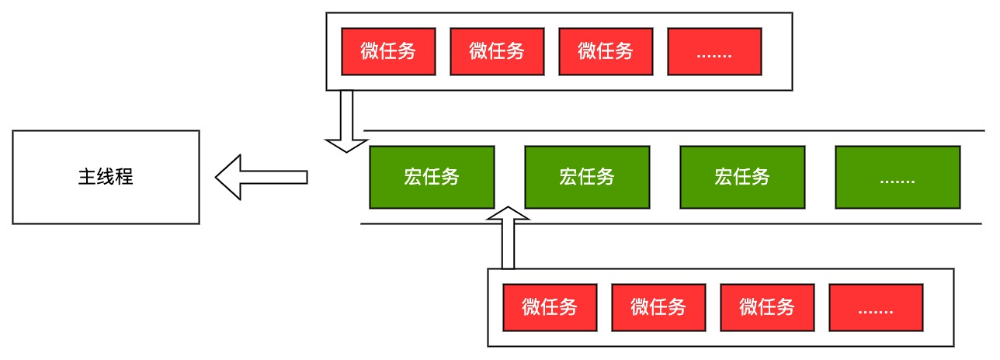

# 单线程&事件循环

## 一、进程（Process）与线程（Thread） <a href="#e4-b8-80-e8-bf-9b-e7-a8-8bprocess-e4-b8-8e-e7-ba-bf-e7-a8-8bthread" id="e4-b8-80-e8-bf-9b-e7-a8-8bprocess-e4-b8-8e-e7-ba-bf-e7-a8-8bthread"></a>

概念：

* 进程： CPU资源分配的最小单位
* 线程： CPU调度的最小单位

> （便于记忆：先进程后线程，谐音`“进献”`）

类比：

* 进程好比工厂，有单独的专属自己的工厂资源（内存空间）
* 线程好比工人，多个工人在一个工厂中协作工作，工厂与工人是 1:n的关系。即**一个进程由一个或多个线程组成，线程是一个进程中代码的不同执行路线**
* 工厂的空间是工人们共享的，这象征**进程的每个线程共享进程内存空间**
* 多个工厂之间独立存在。即**进程之间相互独立**

实例：

以Chrome浏览器中为例，当你打开一个 Tab 页时，其实就是创建了一个进程，一个进程中可以有多个线程，比如渲染线程、JS 引擎线程、HTTP 请求线程等等


## 二、JavaScript与单线程

JavaScript是单线程的，是指在JS引擎中负责解释和执行JavaScript代码的线程只有一个，叫主线程。实际上JS引擎中还存在其他的线程，用来处理异步任务，如ajax请求、DOM事件、定时器、I/O操作，统称为工作线程。

总结：

* **主线程**：负责解释和执行JavaScript代码
* **工作线程**：负责处理异步任务，处理完之后将消息放到任务队列


## 三、事件循环（Event Loop）

<figure><figcaption></figcaption></figure>

**过程：**

* 主线程只会做一件事情，就是从消息队列里面不停地取消息、执行消息，再取消息、再执行
* 消息队列为空时，就会等待，直到消息队列有新消息
* 主线程只有在将当前的消息执行完成后，才会去取下一个消息
* 主线程在执行当前消息时可能新的异步任务，新的异步任务会往消息队列添加新消息，循环往复

**主体：**

* 主线程
* 消息队列
* 异步任务

## 四、宏任务（macrotask）、微任务（microtask）

消息队列里的消息分为宏任务和微任务两种。

**过程：**

* 主线程去消息队列中取任务时，如果微任务队列不为空，就先按序执行微任务队列的微任务；
* 微任务队列执行完后，开始从宏任务队列中取宏任务进行执行；
* 每个宏任务间隔先会检查微任务队列，只有微任务队列为空后，才从宏任务队列取出下一个宏任务进行执行。

<figure><figcaption></figcaption></figure>

**代码验证：**

```javascript
setTimeout(()=>{
    console.log('timer2')
    Promise.resolve().then(function() {
        console.log('promise2')
    })
}, 10)
setTimeout(()=>{
    console.log('timer1')
    Promise.resolve().then(function() {
        console.log('promise1')
    })
})
Promise.resolve().then(function() {
  console.log('promise0')
})
```

**输出：**

```
promise0
timer1
promise1
timer2
promise2
```

**解析：**

1. Promise是微任务，setTimeout是宏任务
2. 这段代码执行完后，微任务队列有promise0，宏任务队列有：timer1、timer2
3. 先执行promise0，然后执行timer1，执行timer1过程中有产生一个微任务promise1
4. 在执行下一个宏任务（timer2）之前，先执行微任务队列（promise1）
5. 微任务队列为空，开始执行下一个宏任务timer2，同样在执行过程产生了微任务promise2
6. 然后开始执行微任务队列

更多异步任务及分类参见：[常见异步](chang-jian-yi-bu.md)


参考：

* [https://developer.mozilla.org/zh-CN/docs/Web/JavaScript/EventLoop](https://developer.mozilla.org/zh-CN/docs/Web/JavaScript/EventLoop)
* [https://segmentfault.com/a/1190000004322358](https://segmentfault.com/a/1190000004322358)
* [http://www.ruanyifeng.com/blog/2013/10/event\_loop.html](http://www.ruanyifeng.com/blog/2013/10/event\_loop.html)
