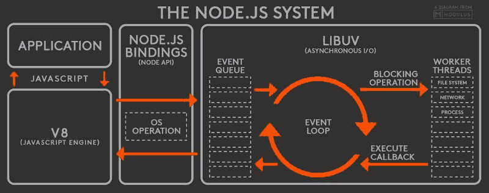

# 页面渲染

从输入url敲击回车键到页面渲染出来，大致可以分为3大阶段：

1. **浏览器请求发送前**

&#x20;      强缓存检查 => DNS解析 => TCP连接 => TLS连接

2. **服务器处理数据**

&#x20;      协议缓存 => 业务逻辑计算 => 响应结果

3. **浏览器渲染页面**

&#x20;      HTML解析成DOM树 => CSS解析成CSSOM树 => 合成Render树 => 布局 => 绘制&#x20;

<figure><figcaption>
页面渲染流程
</figcaption></figure>

参考：

* [https://developer.mozilla.org/zh-CN/docs/Web/Performance/How\_browsers\_work](https://developer.mozilla.org/zh-CN/docs/Web/Performance/How\_browsers\_work)
* [https://developer.mozilla.org/zh-CN/docs/Web/Performance/Critical\_rendering\_path](https://developer.mozilla.org/zh-CN/docs/Web/Performance/Critical\_rendering\_path)
