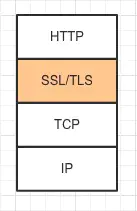
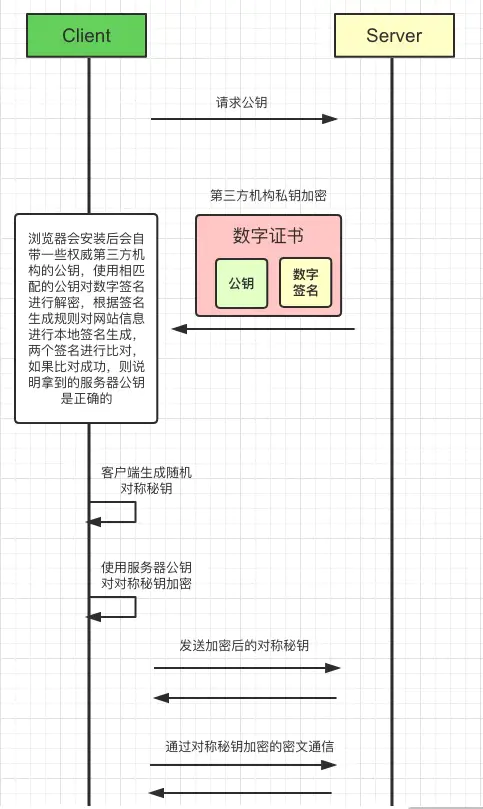
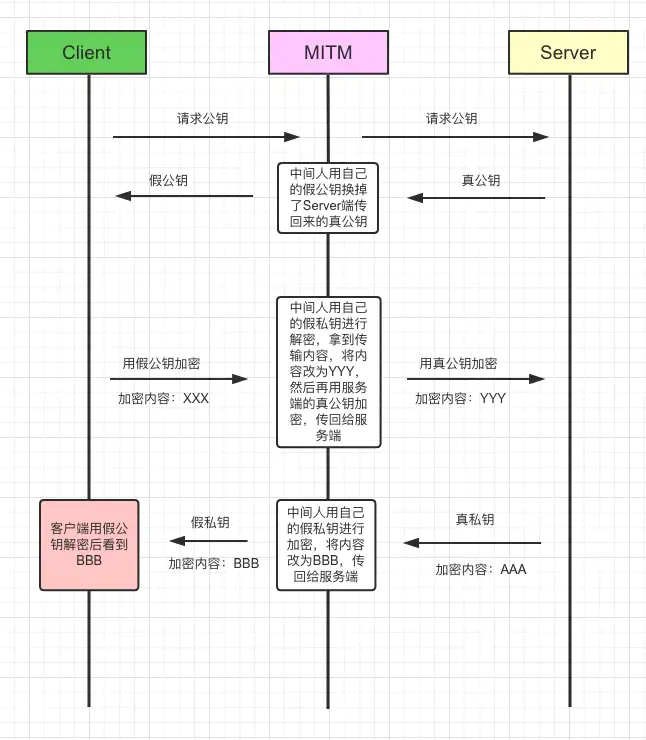
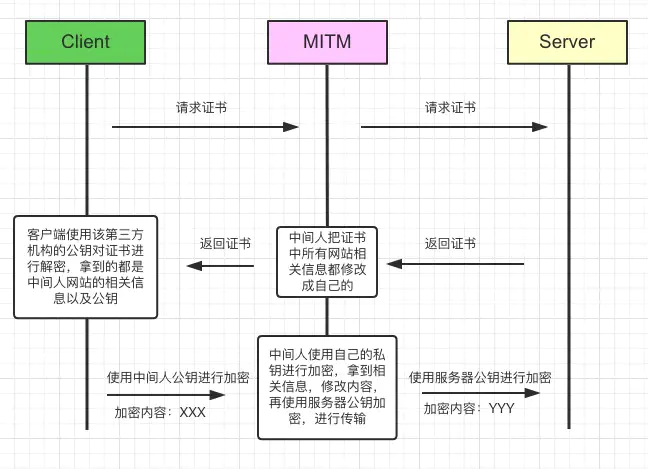

# HTTPS

## 一、和HTTP的关系？

HTTPS = HTTP + TLS/SSL

## 二、处于计算机网络的哪一层？

<figure><figcaption></figcaption></figure>

## 三、流程

<figure><figcaption>
通信流程
</figcaption></figure>

涉及两种加密：

* 对称加密（随机字符串）
* 非对称加密（公钥+私钥）

## 四、FQA

1. **TLS层为什么要在TCP层之上？**

> 答：TLS层属于应用层，需要TCP建立连接提供数据交互通道，用于数据的接发，比如：数字证书、密钥

2. **为啥要用数字证书传输公钥，而不是直接传输公钥？**

> 答：避免公钥被篡改，即中间人攻击（MIMT）。直接传输公钥如果被中间人拿到，中间人可以篡改，将自己的公钥发给客户端，然后用窃取的公钥和服务端通信。
>
>

<figure><figcaption>
中间人攻击
</figcaption></figure>

3. **证书都包含什么内容？**

> 答：数字证书 = 网站信息+ 网站公钥 + 数字签名

<figure><figcaption></figcaption></figure>

4. **证书中的数字签名是如何生成的？**

> 答：
>
> 第1步：将网站信息进行MD5加密&#x20;
>
> 第2步：再用**第三方机构私钥**对MD5的结果加密**（**<mark style="color:red;">**防止中间人攻击的关键**</mark>**）**

5. **证书中为什么一定要有数字签名？**

> 答：防止服务端的公钥被篡改。如果没有签名，中间人如果把网站信息和公钥都篡改了，和直接传输公钥没有本质的区别，还会形成中间人攻击：&#x20;

<figure><figcaption></figcaption></figure>

6. 客户端如何验证证书有效性的？

> 答：浏览器安装后会内置一些权威第三方认证机构的公钥，比如VeriSign、Symantec以及GlobalSign等等，验证签名的时候直接就从本地拿到相应**第三方机构的公钥**，对用**第三方机构私钥加密后的数字签名**进行解密得到真正的**数字签名**，然后客户端利用签名生成规则进行签名生成，看两个签名是否匹配，如果匹配认证通过，不匹配则获取证书失败。

7. 证书验证成功后为啥改为对称加密？

> 答：非对称相比于对称加密加密开销太大

参考：

* [https://juejin.cn/post/6844903545272041479](https://juejin.cn/post/6844903545272041479)
* [https://mp.weixin.qq.com/s/0M6vzrp52zpyAtmGcBQKTg](https://mp.weixin.qq.com/s/0M6vzrp52zpyAtmGcBQKTg)
