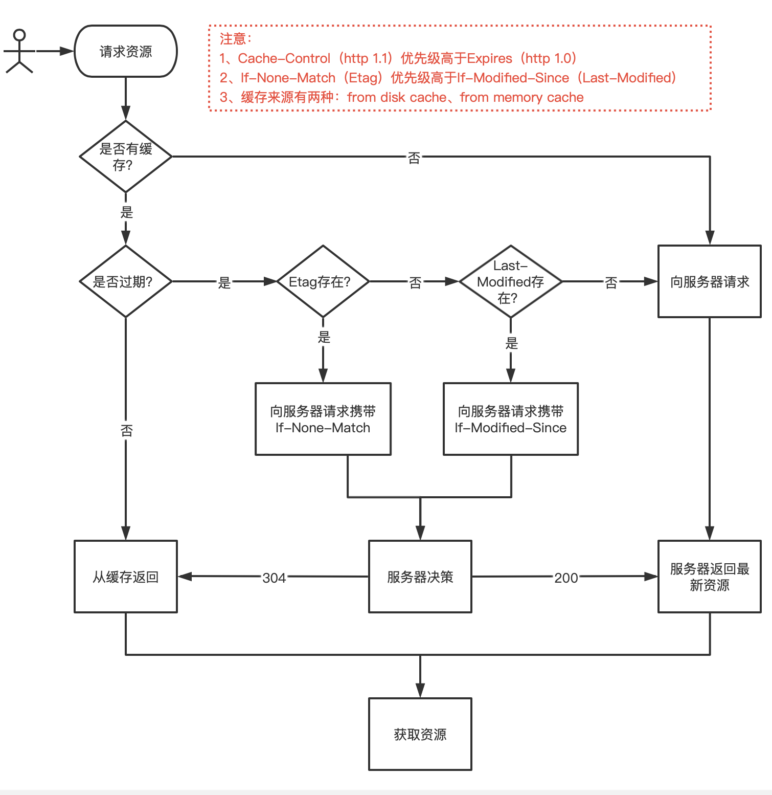

# 浏览器缓存

### 一、缓存机制

主要分为两部分：

* **强制缓存（客户端验证）**
  * Expires
  * Cache-Control
* **协议缓存（服务端验证）**
  * Etag/If-None-Match
  * Last-modified/If-Modified-Since

Etag、Last-modified是http协议`响应字段`；If-None-Match、If-Modified-Since是http协议`请求字段`

<figure><figcaption>
浏览器缓存机制
</figcaption></figure>

### 二、延伸思考

**1.已经有了强制缓存为什么还要新增协议缓存？**

> 答：对于客户端的缓存虽然过期了，但文件可能还继续可用，比如服务端此时的文件内容并没有变化。概括来说：`资源过期了但内容未必有修改，没有修改则可以继续使用`

**2. 强制缓存只验证Expires会有什么问题？**

> 答：Expires是个服务端返回的时间点，如果客户端和服务端时间有误差（手动修改客户端时间），可能导致缓存命中出现误差。 比如服务端返回的Expires是2022-4-25 12:00:00，而客户端的时间被调整成 2022-4-26 12:00:00，则此时将误判为资源过期，向服务器获取新资源，造成不必要的资源浪费

**3.Cache-Control的出现是否解决了expires存在的问题？它出现主要解决什么问题？**

> 答：
>
> （1）并没有完全解决。Cache-Control的max-age返回的是时间段，并且将写入缓存的时间作为时间起点，这样即便是当时浏览器的时间和服务端的时间有差异，也不会影响缓存有效性的判断，除非在缓存写入后浏览器再次更改时间。

> （2）Cache-Control更多是对缓存的行为做了完善，比如对于
>
> * 不缓存（no-store）
> * <mark style="color:red;">跳过强制缓存直接协议缓存（no-cache）</mark>
> * 是否允许除客户端之外的其他节点（比如代理服务器）缓存（public）
> * 是否禁止代理服务器缓存（private，默认）

**4.no-cache和no-store区别？**

> 答： no-cache**不使用**缓存（但允许对资源进行缓存）； no-store**不允许**缓存

**5.协议缓存只用last-modified验证会有什么问题？**

> 答：
>
> （1）Last-Modified的时间是秒级的，资源可能在即将失效的最后一秒内做了（多次）变更，导致客户端在最后一秒内过来验证时认为还没有失效，于是继续使用了缓存&#x20;
>
> （2）有些情况下服务端的文件是定期生成的，文件内容并没有变化，但修改时间有变化，导致客户端每次来验证时得到的结果都是协议缓存失效

**6.Etag为什么能够解决last-modified的问题？**

> 答：Etag是服务端对资源内容进行哈希计算后的结果，相比于用最后修改时间能够精准的判断文件到底是否有修改

**7.验证Etag有没有副作用？**

> 答：性能差。体现在每次请求时，服务端都必须对资源进行哈希计算，这比起简单获取一下修改时间，开销要大了很多。

**8.既然Etag能精准判断文件是否修改，为啥还要验证Last-Modified？**

> 答：Etag 和 Last-Modified 是允许一起使用的，服务器会优先验证 Etag，在 Etag 一致的情况下，再去对比 Last-Modified，这是为了防止有一些 HTTP 服务器未将文件修改日期纳入哈希范围内，导致缓存浪费

### 三、总结

<figure><figcaption>
浏览器缓存总结
</figcaption></figure>

参考：

* [https://juejin.cn/post/7178794675044614203](https://juejin.cn/post/7178794675044614203)
* [https://www.cnblogs.com/chenqf/p/6386163.html](https://www.cnblogs.com/chenqf/p/6386163.html)
* [https://cloud.tencent.com/developer/news/588770](https://cloud.tencent.com/developer/news/588770)
* [https://juejin.cn/post/6844903634002509832](https://juejin.cn/post/6844903634002509832)
* [https://www.jianshu.com/p/54cc04190252](https://www.jianshu.com/p/54cc04190252)
