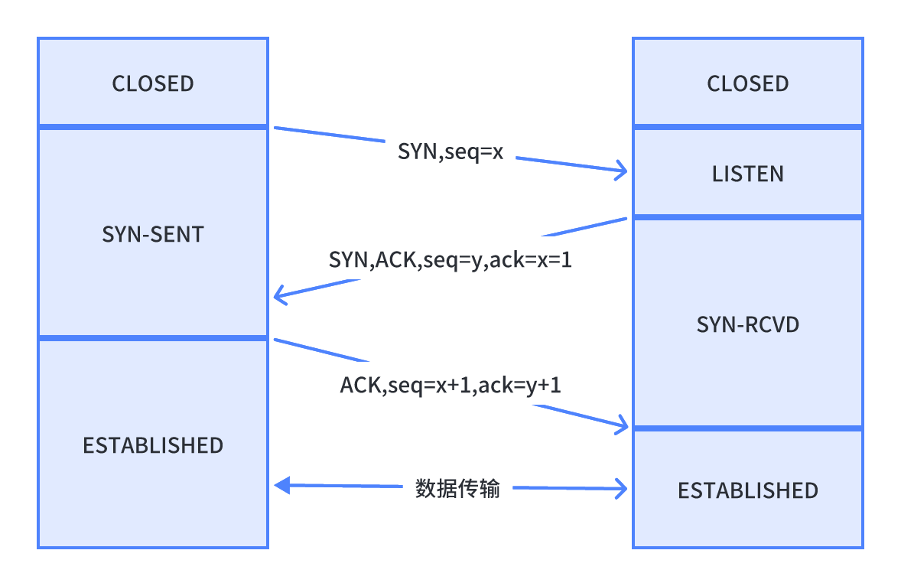

# 建立连接（三次握手）

<figure><figcaption></figcaption></figure>

**1、为什么是三次握手，而不是两次或者四次？**

四次握手浪费，两次握手不能保证“双方同时具备收发功能”

**2、三次握手是否可以携带数据？**

第三次握手的时候可以携带。前两次握手不能携带数据。

前两次如果携带数据容易增加服务器被攻击的风险；第三次握手时客户端已经是`ESTABLISHED`状态，并且已经能够确认服务器的接收、发送能力正常，相对安全。
