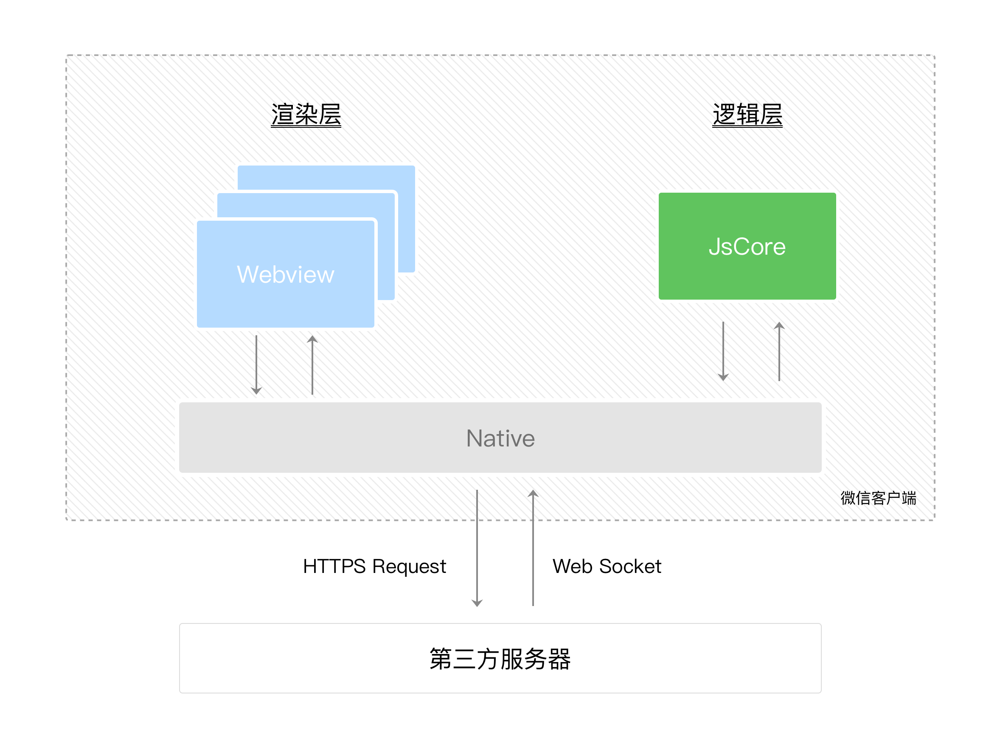

# 双线程架构

<figure><figcaption>
微信小程序双线程架构图
</figcaption></figure>

#### 1、什么是微信小程序双线程架构？

小程序框架系统分为两部分：**逻辑层**（App Service）和 **视图层**（View）

小程序的渲染层和逻辑层分别由2个线程管理：

* 渲染层：使用了WebView 进行渲染；每个页面对应一个WebView（这也是为什么小程序页面切换接近原生的原因，同时也限定了小程序的页面不宜过多）
* 逻辑层：采用 JsCore 线程运行 JS 脚本

这两个线程的通信会经由微信客户端做中转。

#### 2、微信小程序为什么采用双线程架构？

**产品定位**决定了**技术目标**，继而决定了**系统架构**

| 产品定位      | 技术目标 | 系统架构                         |
| --------- | ---- | ---------------------------- |
| 运行在微信App中 | 安全   | 逻辑层不可直接操作视图，两者通信由宿主（微信客户端）中转 |
| 体验接近原生应用  | 高效   | 视图层每个页面都是一个单独的webview        |

#### 3、双线程下微信小程序的界面是如何渲染的？ 

在渲染层，宿主环境会把WXML转化成对应的JS对象，在逻辑层发生数据变更的时候，我们需要通过宿主环境提供的setData方法把数据从逻辑层传递到渲染层，再经过对比前后差异，把差异应用在原来的Dom树上，渲染出正确的UI界面

<figure><figcaption>
微信小程序页面渲染
</figcaption></figure>

参考：

* [https://cloud.tencent.com/developer/article/1826156](https://cloud.tencent.com/developer/article/1826156)
* [https://developers.weixin.qq.com/ebook?action=get\_post\_info\&volumn=1\&lang=zh\_CN\&book=miniprogram\&docid=0006a2289c8bb0bb0086ee8c056c0a](https://developers.weixin.qq.com/ebook?action=get\_post\_info\&volumn=1\&lang=zh\_CN\&book=miniprogram\&docid=0006a2289c8bb0bb0086ee8c056c0a)
* [https://developers.weixin.qq.com/ebook?action=get\_post\_info\&volumn=1\&lang=zh\_CN\&book=miniprogram\&docid=0000286f908988db00866b85f5640a](https://developers.weixin.qq.com/ebook?action=get\_post\_info\&volumn=1\&lang=zh\_CN\&book=miniprogram\&docid=0000286f908988db00866b85f5640a)
* [https://developers.weixin.qq.com/miniprogram/dev/framework/quickstart/framework.html](https://developers.weixin.qq.com/miniprogram/dev/framework/quickstart/framework.html)

